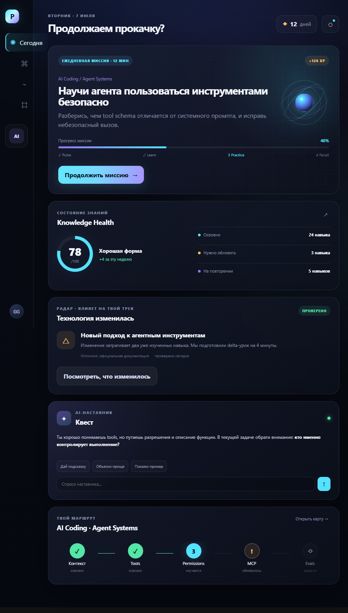

# OrbitQuest

OrbitQuest — живая космическая обучающая игра для взрослых разработчиков. Игрок восстанавливает спутниковую сеть знаний Atlas, а подтверждённые изменения технологий превращаются в миссии, практику и обновления уже освоенных навыков.

## Открыть базу в Obsidian

1. Откройте Obsidian.
2. Выберите **Open folder as vault**.
3. Укажите эту папку.
4. Начните с [[00-Home]].

## Запустить production-каркас

Требуется Node.js 22+.

```powershell
npm install
npm run dev:api
```

Во втором терминале:

```powershell
npm run dev:web
```

Web-приложение откроется на `http://127.0.0.1:4173`, API — на `http://127.0.0.1:8787`.

Проверки:

```powershell
npm test
npm run typecheck
npm run build
npm run smoke
```

## Посмотреть исходный frontend-прототип

Откройте `prototype/index.html` в браузере. Прототип не требует сборки, API-ключей или установки зависимостей.

Старый SaaS-концепт сохранён для сравнения:



## Статус

Первый production-инкремент реализован: npm workspace, mobile-first React PWA, typed bootstrap API, offline fallback и детерминированная машина миссии. Gemini и Python sandbox пока не подключены. Никакие секреты в репозитории не хранятся.

Утверждённый технический план: [product/Implementation-Plan.md](product/Implementation-Plan.md).
